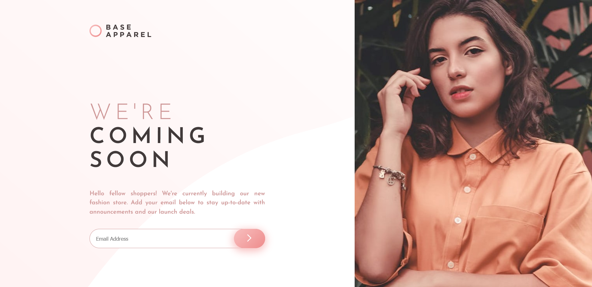
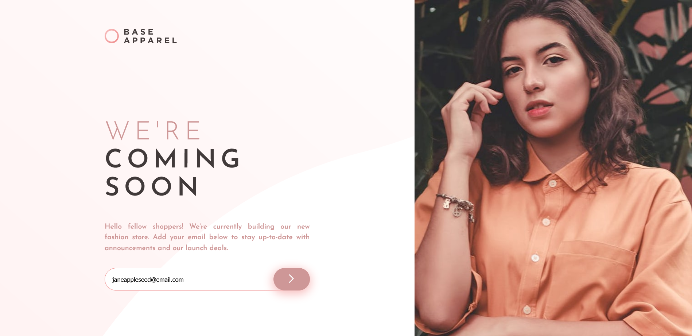
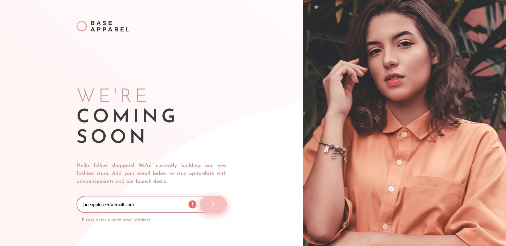
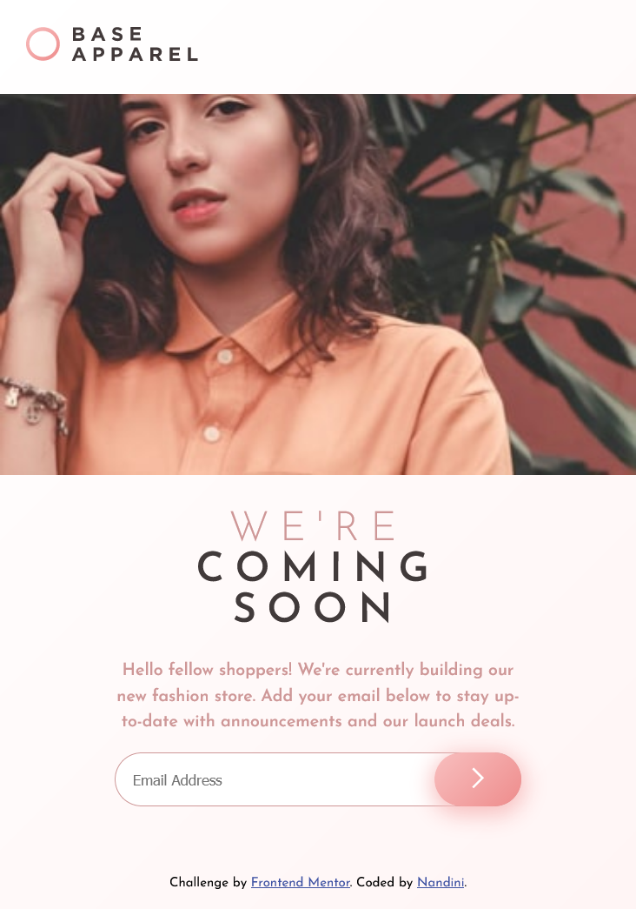
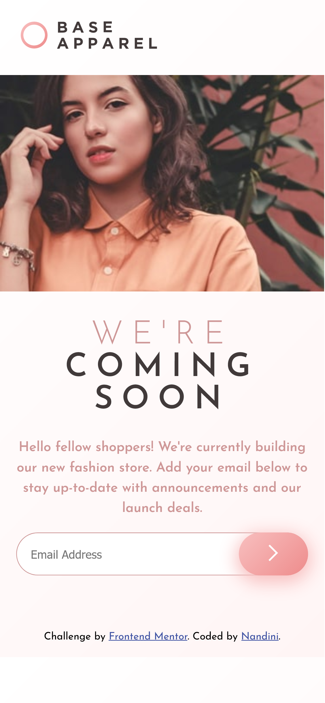
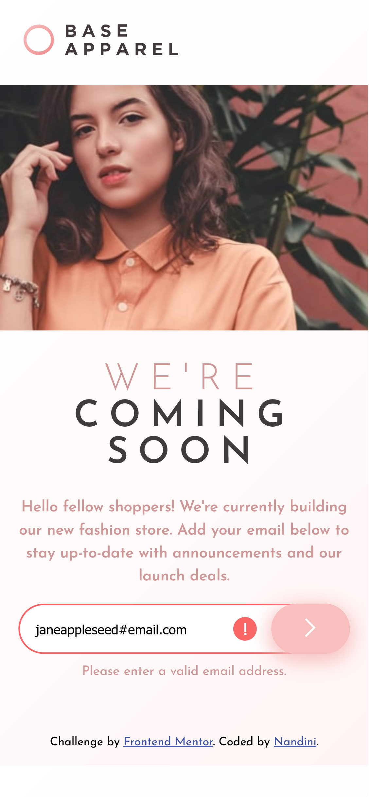

# Frontend Mentor - Base Apparel coming soon page solution

This is a solution to the [Base Apparel coming soon page challenge on Frontend Mentor](https://www.frontendmentor.io/challenges/base-apparel-coming-soon-page-5d46b47f8db8a7063f9331a0). Frontend Mentor challenges help you improve your coding skills by building realistic projects. 

## Table of contents

- [Overview](#overview)
  - [Screenshot](#screenshot)
  - [Links](#links)
- [My process](#my-process)
  - [Built with](#built-with)
- [Author](#author)

## Overview

### Screenshot

### Desktop

### Responsive

### Mobile

### Links

- Solution URL: [Base Apparel coming soon page](https://github.com/NandiniCooppen/base-apparel-coming-soon-master)
- Live Site URL: [Base Apparel coming soon page](https://nandinicooppen-base-apparel-page.netlify.app/)

## My process

### Built with

- Semantic HTML5 markup

- Mobile first approach
- CSS flexbox
- CSS custom properties
- CSS animation [using Animate.css]( https://animate.style/)

- Modern Javascript 
- modularity
- Arrow functions
- Template Literals
- ClassList Manipulation

## Author

- Github - [Nandini](https://github.com/NandiniCooppen)
- Frontend Mentor - [@NandiniCooppen](https://www.frontendmentor.io/profile/NandiniCooppen)